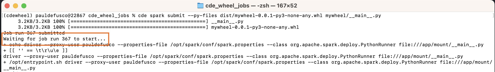
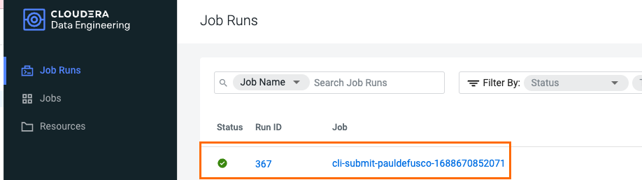
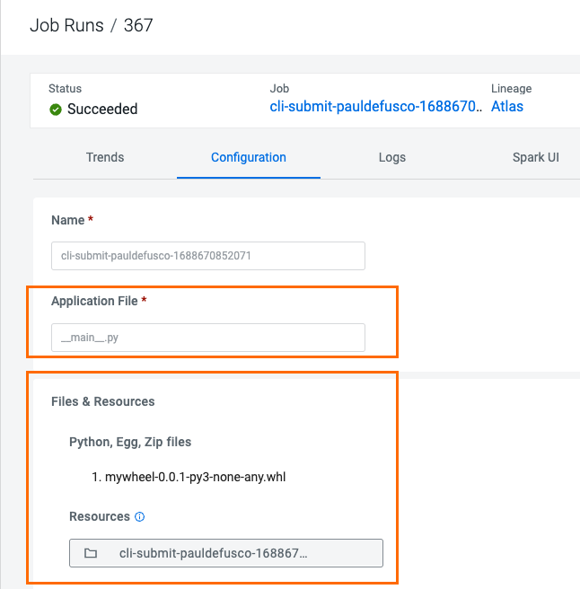

# CDE Wheel Jobs

## Objective

Cloudera Data Engineering (CDE) is a serverless service for Cloudera Data Platform that allows you to submit batch jobs to auto-scaling virtual clusters. CDE enables you to spend more time on your applications, and less time on infrastructure.

Wheels allow for faster installations and more stability in the package distribution process. In the context of PySpark, Wheels allow you to make python dependent modules available to executors without having to do pip install dependencies on every node and to use application source code as a package.

In this tutorial you will create a CDE Spark Job using a Wheel file via the CDE CLI.


## Project Requirements

In order to execute the Hands On Labs you need:

* A Spark 3 and Iceberg-enabled CDE Virtual Cluster (Azure, AWS and Private Cloud ok).
* The CDE CLI installed on your local machine. If you need to install it for the first time please follow [these steps](https://docs.cloudera.com/data-engineering/cloud/cli-access/topics/cde-cli.html)
* Familiarity with Python, PySpark and the CDE CLI is highly recommended.
* No script code changes are required.


## Project Setup

Clone this GitHub repository to your local machine or the VM where you will be running the script.

```
mkdir ~/Documents/cde_wheel_jobs
cd ~/Documents/cde_wheel_jobs
git clone https://github.com/pdefusco/CDE_Wheel_Jobs.git
```

Alternatively, if you don't have git installed on your machine, create a folder on your local computer; navigate to [this URL](https://github.com/pdefusco/CDE_Wheel_Jobs.git) and manually download the files.


## Step by Step Instructions

A CDE Job is Application code along with defined configurations and resources. Jobs can be run on demand or scheduled. An individual job execution is called a job run.

Similar to a CDE Spark Job, a CDE Spark Submit executes a Job with the difference that it doesn't allow you to reuse the CDE Job Definition to rerun the job. The CDE Spark Submit is the quickest way to prototype a job.

In this example we will run a CDE Spark Submit with the Wheel file.

The Spark Job code can be found in ```mywheel/__main__.py``` file but it does not require modifications. If you are familiar with PySpark you might notice this is a very simple Spark SQL job for pure demo purposes.

The Wheel has already been created for you and will automatically download to the ```dist``` directory in your local machine upon cloning this project.

Once you have the CDE CLI installed on your terminal you can launch a CDE Job from local via the CDE CLI via the ```cde spark submit``` command. Copy the following command and execute it in your terminal:

```
cde spark submit --py-files dist/mywheel-0.0.1-py3-none-any.whl mywheel/__main__.py
```

In the terminal, validate that the Spark Job has launched successfully and note the Job Run ID:



Next, navigate to the CDE Job Runs UI and validate job execution:



Open the Job Configurations tab and notice that the Wheel has been uploaded in a File Resource for you.




## Conclusions & Next Steps

CDE is the Cloudera Data Engineering Service, a containerized managed service for Spark and Airflow.

If you are exploring CDE you may find the following tutorials relevant:

* [Spark 3 & Iceberg](https://github.com/pdefusco/Spark3_Iceberg_CML): A quick intro of Time Travel Capabilities with Spark 3.

* [Simple Intro to the CDE CLI](https://github.com/pdefusco/CDE_CLI_Simple): An introduction to the CDE CLI for the CDE beginner.

* [CDE CLI Demo](https://github.com/pdefusco/CDE_CLI_demo): A more advanced CDE CLI reference with additional details for the CDE user who wants to move beyond the basics.

* [CDE Resource 2 ADLS](https://github.com/pdefusco/CDEResource2ADLS): An example integration between ADLS and CDE Resource. This pattern is applicable to AWS S3 as well and can be used to pass execution scripts, dependencies, and virtually any file from CDE to 3rd party systems and viceversa.

* [Using CDE Airflow](https://github.com/pdefusco/Using_CDE_Airflow): A guide to Airflow in CDE including examples to integrate with 3rd party systems via Airflow Operators such as BashOperator, HttpOperator, PythonOperator, and more.

* [GitLab2CDE](https://github.com/pdefusco/Gitlab2CDE): a CI/CD pipeline to orchestrate Cross-Cluster Workflows for Hybrid/Multicloud Data Engineering.

* [CML2CDE](https://github.com/pdefusco/cml2cde_api_example): an API to create and orchestrate CDE Jobs from any Python based environment including CML. Relevant for ML Ops or any Python Users who want to leverage the power of Spark in CDE via Python requests.

* [Postman2CDE](https://github.com/pdefusco/Postman2CDE): An example of the Postman API to bootstrap CDE Services with the CDE API.

* [Oozie2CDEAirflow API](https://github.com/pdefusco/Oozie2CDE_Migration): An API to programmatically convert Oozie workflows and dependencies into CDE Airflow and CDE Jobs. This API is designed to easily migrate from Oozie to CDE Airflow and not just Open Source Airflow.

For more information on the Cloudera Data Platform and its form factors please visit [this site](https://docs.cloudera.com/).

For more information on migrating Spark jobs to CDE, please reference [this guide](https://docs.cloudera.com/cdp-private-cloud-upgrade/latest/cdppvc-data-migration-spark/topics/cdp-migration-spark-cdp-cde.html).

If you have any questions about CML or would like to see a demo, please reach out to your Cloudera Account Team or send a message [through this portal](https://www.cloudera.com/contact-sales.html) and we will be in contact with you soon.
